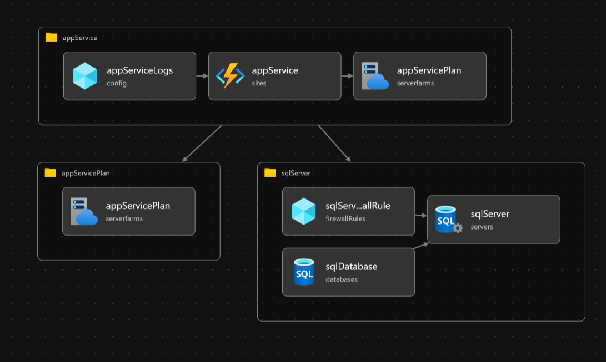
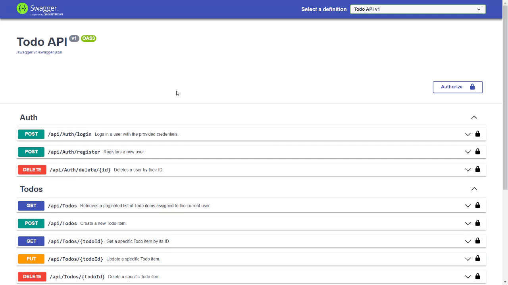

# Todo API Project 📝

  

## Table of Contents

- [Todo API Project 📝](#todo-api-project-)
  - [Table of Contents](#table-of-contents)
  - [About the API 📡](#about-the-api-)
  - [Technologies Used 🔧](#technologies-used-)
  - [User Flow 👥](#user-flow-)
  - [API Endpoints 🛠️](#api-endpoints-️)
    - [Authentication Endpoints](#authentication-endpoints)
    - [Todo Endpoints](#todo-endpoints)
  - [Azure Bicep and Modules ☁️](#azure-bicep-and-modules-️)
  - [⚠️ Warning](#️-warning)
  - [Azure Scripts 📜](#azure-scripts-)
  - [Screenshots 📸](#screenshots-)
  - [Demo 🌐](#demo-)
  - [GitHub Actions CI/CD Pipeline 🐙](#github-actions-cicd-pipeline-)
  - [📝 License](#-license)

## About the API 📡

The API provides endpoints for users to create, read, update, and delete todo tasks. It uses JWT for authentication and authorization.

## Technologies Used 🔧

The project is written in C# and uses the following technologies:

- .NET Core for the API
- Dapper for data access
- SQL Server Data Tools (SSDT) for database management
- JWT for authentication
- Azure Bicep for infrastructure as code
- GitHub Actions for CI/CD

## User Flow 👥

To use the API, users need to:

1. Register a new account using the `/register` endpoint.
2. Log in with their new account using the `/login` endpoint. This will return a token.
3. Use the token to authenticate their requests to the other endpoints.

## API Endpoints 🛠️

### Authentication Endpoints

| Method | Endpoint              | Description                  |
| ------ | --------------------- | ---------------------------- |
| POST   | /api/Auth/register    | Register new user            |
| POST   | /api/Auth/login       | Login user and get JWT token |
| DELETE | /api/Auth/delete/{id} | Delete user account          |

### Todo Endpoints

| Method | Endpoint                     | Description               |
| ------ | ---------------------------- | ------------------------- |
| GET    | /api/Todos                   | Get all todos (paginated) |
| GET    | /api/Todos/{todoId}          | Get specific todo by ID   |
| POST   | /api/Todos                   | Create new todo           |
| PUT    | /api/Todos/{todoId}          | Update todo task          |
| PUT    | /api/Todos/{todoId}/Complete | Mark todo as complete     |
| DELETE | /api/Todos/{todoId}          | Delete todo               |

> Note: All Todo endpoints require authentication using JWT token obtained from login endpoint. Include the token in the Authorization header as `Bearer <token>`.

## Azure Bicep and Modules ☁️

The project uses Azure Bicep for infrastructure as code. The Bicep files define the resources needed for the project, such as the App Service and SQL Server.

## ⚠️ Warning

> **Important:** The Azure resources used in this project are temporary as they are part of an Azure Cloud Sandbox which was purchased temporarily. Please ensure to replace these resources with your own before deploying the project.

## Azure Scripts 📜

The project includes Azure scripts for deploying the infrastructure and the application. The scripts use the Azure CLI and PowerShell.

## Screenshots 📸

## Demo 🌐

This API is currently being used by [TaskTackler](https://github.com/nenad0707/TaskTackler), a frontend application that demonstrates the full functionality of this API.

  

## GitHub Actions CI/CD Pipeline 🐙

The project uses GitHub Actions for continuous integration and continuous deployment. The workflows include building the application, running tests, and deploying to Azure.

## 📝 License

This project is [MIT](https://opensource.org/licenses/MIT) licensed.
